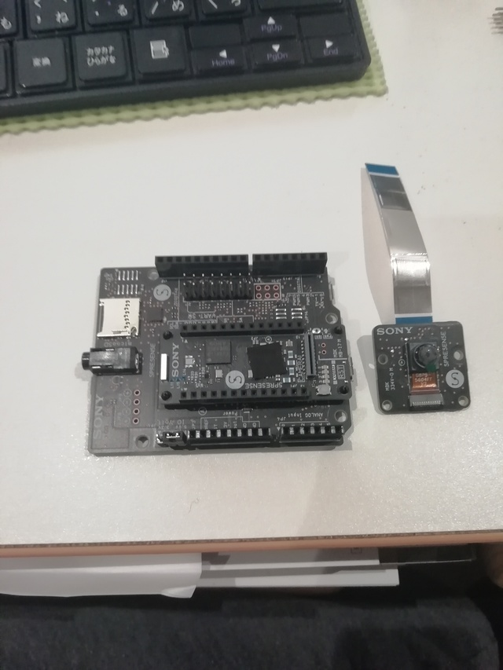

# 章タイトル

図のキャプションは「<a class="FigImageRef" href="#IMAGE1"></a>」や「<a class="FigImageRef" href="#IMAGE2"></a>」のように付けることが出来るので参照することが可能です。


<span id="IMAGE1"></span>


<span id="IMAGE2"></span>

ソースコードなどのキャプションは「<a class="FigCodeRef" href="#LIST1"></a>」のように付けることが出来るので参照することが可能です。

```txt:ソースコード
./memwrite FD4AB070 54
```
<span id="LIST1"></span>

表などのキャプションは「<a class="FigTableRef" href="#TABLE1"></a>」のように付けることができるので参照することが可能です。


```txt:表のタイトル2
```

| 機能名 | Bits | R/W | 初期値 | 概要 |
|-----|-----|-----|-----|-----|
| 未使用 | 31:7 | - | 0x0 | |
| AUD_STREAM2_SEL | 6 | rw | 0x0 | STREAM2 Enable<br>0: Disable graphics from memory<br>1: Enable graphics from
<span id="TABLE1"></span>


wavedromの波形表示は将来対応予定です。

```wavedrom:波形
{signal: [
  {name: 'clk', wave: 'p.....|...'},
  {name: 'dat', wave: 'x.345x|=.x', data: ['head', 'body', 'tail', 'data']},
  {name: 'req', wave: '0.1..0|1.0'},
  {},
  {name: 'ack', wave: '1.....|01.'}
]}
```
